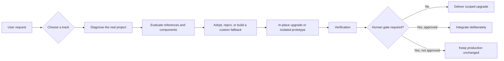

<div align="center">

# Vibe-Upgrader

**A UI/UX, visual, and interaction upgrade Skill for real frontend projects—controlled by default, experimental only behind an isolated prototype and a human gate.**

[简体中文](./README.md) · [English](./README.en.md)

 

[Live Showcase](https://vibe-upgrader-showcase.vercel.app/) · [Real-world AIGC case](https://vibe-upgrader-aigc-case.vercel.app/) · [GitHub Release](https://github.com/Zeno-wistom/vibe-upgrader/releases/tag/v1.0.0) · [简体中文 README](./README.md)

</div>

<table>
  <tr>
    <td width="50%" align="center">
      <a href="https://vibe-upgrader-showcase.vercel.app/">
        
      </a>
      <br>
      <strong>Interactive Showcase</strong><br>
      <sub>Try the before/after comparison, track decision, and mechanism lab</sub>
    </td>
    <td width="50%" align="center">
      <a href="https://vibe-upgrader-aigc-case.vercel.app/">
        
      </a>
      <br>
      <strong>Real-world AIGC Case</strong><br>
      <sub>A product upgrade delivered inside existing content and constraints</sub>
    </td>
  </tr>
</table>

## What it does

Vibe-Upgrader upgrades existing frontend products. It begins with the real project, requested surface, and user constraints, then decides whether to deliver a controlled in-place improvement or isolate a bolder visual mechanism for approval. It does not interpret every request as permission to redesign the whole site or stack unrelated components for spectacle.

## Start in three steps

### 1. Clone

Clone the Skill into your Codex Skills directory:

```bash
git clone https://github.com/Zeno-wistom/vibe-upgrader.git ~/.codex/skills/vibe-upgrader
```

### 2. Invoke

Call it explicitly in an Agent that supports Skills:

```text
$vibe-upgrader
```

### 3. Describe the upgrade

Name the target surface, scope, content that must stay, and acceptance criteria:

```text
Upgrade the search, filtering, and bulk-action area of this dashboard.
Keep the rest of the page stable and do not redesign the whole product.
```

Vibe-Upgrader is explicit-only. Installing it does not allow it to intervene in unrelated frontend tasks.

> The public repository intentionally excludes the complete local MotionSites corpus because its bulk-redistribution terms could not be confirmed. Without that optional source, the Skill reports the limitation and continues with component evaluation or a custom fallback.

## Standard and Experimental

| | Standard | Experimental |
| --- | --- | --- |
| Best for | Focused UI/UX upgrades in real products | Strong visual direction or non-standard interaction |
| Delivery | Implemented directly inside a controlled scope | Built first as one isolated prototype |
| Creative search | No unrelated reference search | Only the references needed for one mechanism |
| Human gate | Usually no visual approval gate | Never integrated before explicit approval |

## Two real prompt examples

### Standard

```text
$vibe-upgrader

Upgrade the search, filtering, and bulk-action area of this dashboard.
Keep the rest of the page stable and do not redesign the whole product.
```

### Experimental

```text
$vibe-upgrader

Explore a more immersive way to browse this digital archive.
Build the visual direction in an isolated preview and do not integrate it
until I approve it.
```

## Workflow



The formal `decision_task` 3.0 records permission mode, upgrade track, provenance, component decisions, prototype status, and verification boundaries.

## Live Showcase

[Open the live Showcase →](https://vibe-upgrader-showcase.vercel.app/)

The Showcase turns the workflow into a hands-on story: a before/after scrubber, a Standard / Experimental track console, a draggable decision sequence, and a small mechanism lab.


MotionSites was used for mechanism-level reference rather than page copying. `BlurText` informed a lightweight native reveal; `SpotlightCard`, `ScrollStack`, and `TiltedCard` were rejected where they competed with the task, and the final spatial response was built as a custom mechanism.

<details>
<summary>View desktop and mobile screenshots</summary>


</details>

## Real-world AIGC case

[Open PINK SIGNALS →](https://vibe-upgrader-aigc-case.vercel.app/)

PINK SIGNALS was an existing project with seven finished artworks, an established visual identity, and strict content constraints. Vibe-Upgrader preserved the artwork and disclosure language while improving portfolio browsing, full-screen detail navigation, visual hierarchy, responsive behavior, and the isolated Signal experience instead of rebuilding the project from scratch.

All people, scenes, and profile-like material in this case are fictional AIGC-generated content. They do not depict real individuals or real dating profiles.

## Guardrails

- No whole-site redesign by default.
- No component stacking for spectacle alone.
- No Experimental integration before explicit human approval.
- No quality downgrade when an external component is unavailable or rejected.
- No runtime mutation of the installed Skill directory.
- User constraints and verified project facts take priority.

## Repository structure

```text
vibe-upgrader/
├── SKILL.md          # Skill entry point and track routing
├── agents/           # Agent-facing metadata
├── scripts/          # Decision, retrieval, installation, and search helpers
├── references/       # Protocol and verification guidance
├── assets/           # Redistributable aliases only; local corpus excluded
├── tests/            # Workflow and runtime-write regressions
└── docs/media/       # README media
```

## Requirements and compatibility

- Codex or another Agent environment that supports Skills and explicit invocation.
- Python **3.10+** for optional helper scripts and validation utilities.
- Node.js is not required for the core Skill. It is used only for an opted-in compatible component CLI or Registry workflow.
- Windows paths in development evidence are not installation requirements; the repository uses portable relative paths.

## License and third-party boundaries

Vibe-Upgrader's original code and documentation are released under the [MIT License](./LICENSE).

- [MotionSites](https://motionsites.ai/) is an external creative-reference source. The complete local corpus is not included in the public repository.
- [React Bits](https://github.com/DavidHDev/react-bits) is an optional component source. This repository bundles no React Bits component source; React Bits uses its own MIT + Commons Clause terms.
- The Showcase and real-world case are separate projects with their own dependencies and asset provenance.

See [CHANGELOG.md](./CHANGELOG.md) and the [v1.0.0 Release](https://github.com/Zeno-wistom/vibe-upgrader/releases/tag/v1.0.0).
