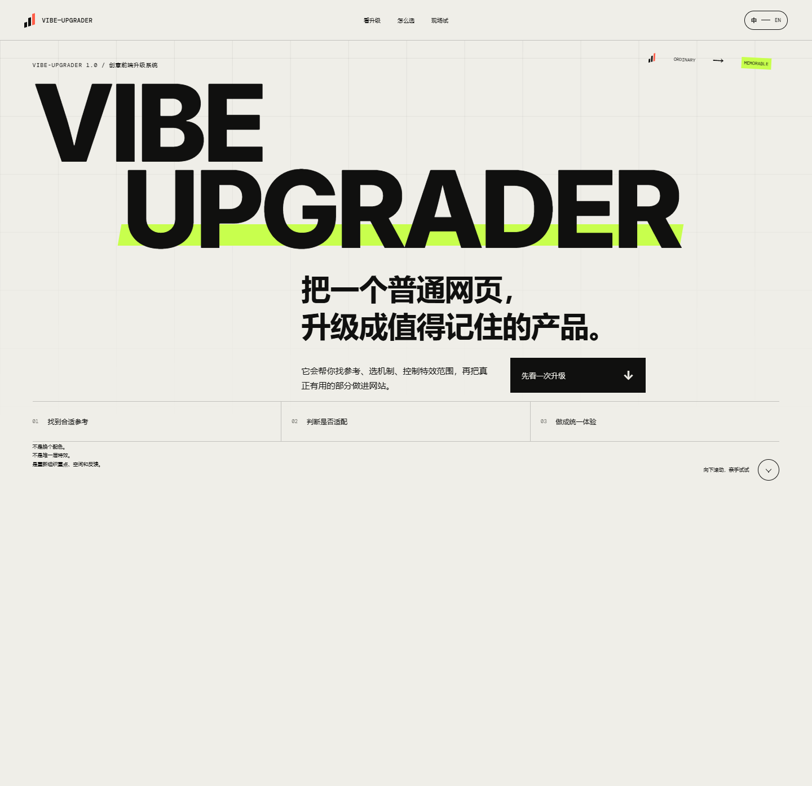
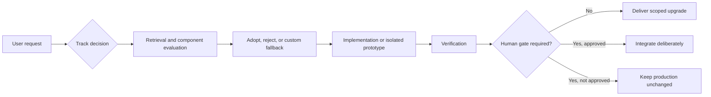
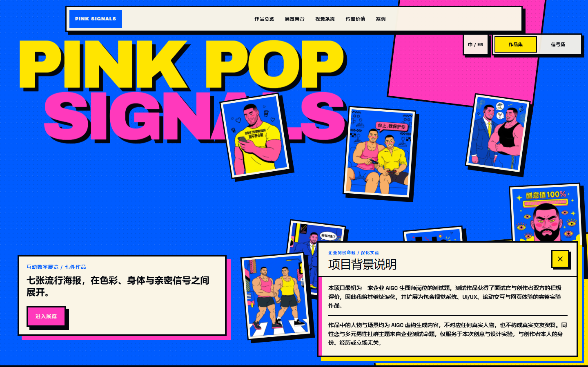

<div align="center">

# Vibe-Upgrader

**A UI/UX, visual, and interaction upgrade Skill for real frontend projects — controlled by default, experimental only behind an isolated prototype and a human gate.**

[Showcase](https://vibe-upgrader-showcase.vercel.app/) · [Real-world case](https://vibe-upgrader-aigc-case.vercel.app/) · [简体中文](./README.zh-CN.md)

 



</div>

## What it does

Vibe-Upgrader upgrades existing frontend products without treating every request as permission to redesign the whole site. It begins with the real project, the requested surface, and the user's constraints, then chooses one of two tracks:

- **Standard** for focused improvements to hierarchy, usability, content, controls, responsive behavior, and brand polish.
- **Experimental** for high-impact motion or non-standard interaction, built first as one isolated prototype that cannot enter the product until a human approves it.

When creative reference is genuinely useful, the Skill can retrieve mechanisms, evaluate expressive component candidates, reject poor fits, and produce an equivalent custom fallback. External availability never becomes an excuse for a generic result.

## Quick start

Install from the public repository into a clean Skills directory:

```bash
git clone https://github.com/Zeno-wistom/vibe-upgrader.git ~/.codex/skills/vibe-upgrader
```

Then invoke it explicitly in a compatible agent:

```text
$vibe-upgrader
```

Vibe-Upgrader is explicit-only. Installing it does not allow it to intervene in every frontend task.

> The public repository intentionally does not bundle the complete local MotionSites corpus. Its public redistribution terms could not be confirmed. The Skill remains usable without that corpus: it reports the missing optional data source and continues with component evaluation or a custom fallback.

## Two tracks

| Standard | Experimental |
| --- | --- |
| Focused UI/UX upgrades in real products | Strong visual direction or non-standard interaction |
| Implemented directly inside a controlled scope | Built first as one isolated prototype |
| No unrelated creative search | Retrieves only the references needed for one mechanism |
| No visual approval gate required | Never integrated before human approval |

## How to use it

### Standard

```text
$vibe-upgrader

Upgrade the search, filtering, and bulk-action area of this dashboard.
Keep the rest of the page stable and do not redesign the whole product.
```

### Experimental

```text
$vibe-upgrader

Explore a more immersive way to browse this digital archive.
Build the visual direction in an isolated preview and do not integrate it
until I approve it.
```

## How it works



The formal `decision_task` 3.0 keeps permission mode, upgrade track, source provenance, component decisions, prototype status, and verification boundaries explicit.

## Showcase

[Open the live showcase →](https://vibe-upgrader-showcase.vercel.app/)


The showcase turns the workflow into a hands-on story: a before/after scrubber, a Standard/Experimental track console, a draggable decision sequence, and a small mechanism lab. MotionSites was used for mechanism-level reference rather than page copying. `BlurText` informed a lightweight native reveal; `SpotlightCard`, `ScrollStack`, and `TiltedCard` were rejected where they competed with the task, and the final spatial response was built as a custom mechanism.

<details>
<summary>Mobile preview</summary>


</details>

## Real-world case

[Open PINK SIGNALS →](https://vibe-upgrader-aigc-case.vercel.app/)



PINK SIGNALS was an existing project with seven finished artworks, an established visual identity, and strict content constraints. Vibe-Upgrader did not rebuild it from scratch. It preserved the artwork and disclosure language while improving portfolio browsing, full-screen detail navigation, visual hierarchy, responsive behavior, and the isolated Signal experience.

All people, scenes, and profile-like material in this case are fictional AIGC-generated content. They do not depict real individuals or real dating profiles.

## Guardrails

- No whole-site redesign by default.
- No component stacking for spectacle alone.
- No Experimental integration before explicit human approval.
- No quality downgrade when an external component is unavailable or rejected.
- No runtime mutation of the installed Skill directory.
- User constraints and verified project facts take priority.

## Repository structure

```text
vibe-upgrader/
├── SKILL.md          # Skill entry point and track routing
├── agents/           # Agent-facing metadata
├── scripts/          # Decision, retrieval, installation, and search helpers
├── references/       # Protocol and verification guidance
├── assets/           # Redistributable aliases only; local corpus excluded
├── tests/            # Workflow and runtime-write regressions
└── docs/media/       # Optimized README media
```

Release documentation, the license, and the changelog live at the repository root.

## Requirements and compatibility

- Codex or another agent environment that supports Skills and explicit invocation.
- Python **3.10+** for the optional helper scripts and validation utilities.
- Node.js is not required for the core Skill. It is used only when an opted-in component search needs a compatible CLI or registry workflow.
- Windows paths in development evidence are not installation requirements; the repository uses portable relative paths.

## License and acknowledgements

Vibe-Upgrader's original code and documentation are released under the [MIT License](./LICENSE).

Third-party resources, component implementations, website references, screenshots, and datasets are not automatically covered by that license:

- [MotionSites](https://motionsites.ai/) is an external creative-reference source. The complete locally collected corpus is **not included** because public bulk-redistribution permission could not be confirmed.
- [React Bits](https://github.com/DavidHDev/react-bits) is evaluated as an optional component source. Vibe-Upgrader bundles no React Bits component source; React Bits uses its own MIT + Commons Clause terms.
- The showcase and real-world case remain separate projects with their own dependencies and asset provenance.

## Release

See [CHANGELOG.md](./CHANGELOG.md) and the [v1.0.0 release](https://github.com/Zeno-wistom/vibe-upgrader/releases/tag/v1.0.0).
