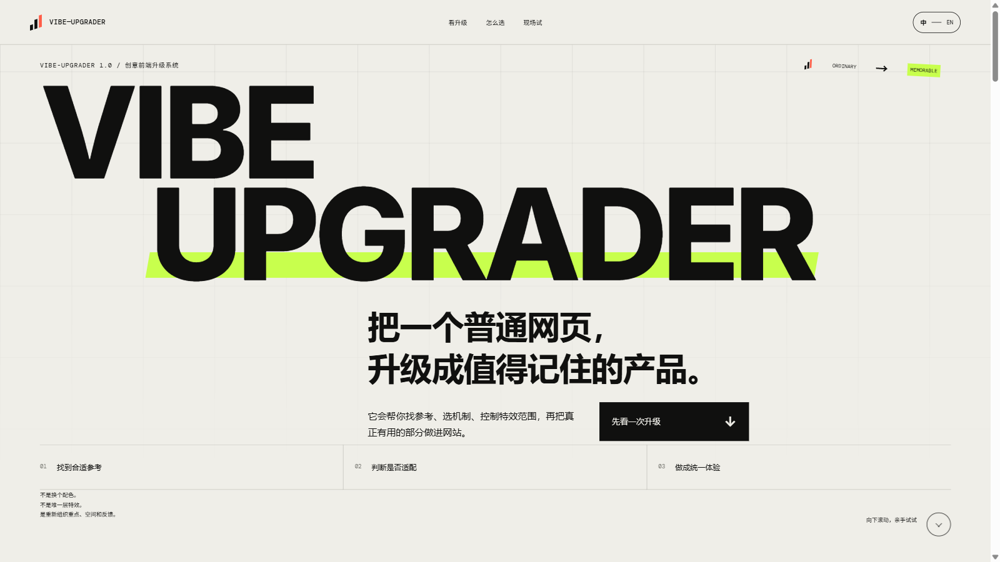
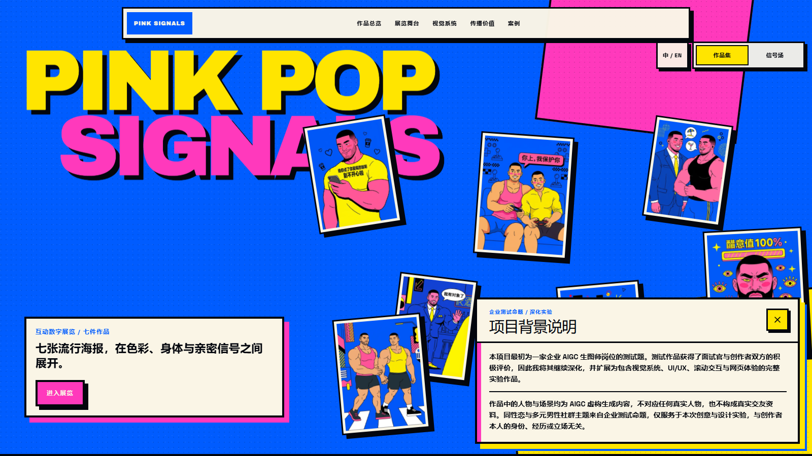
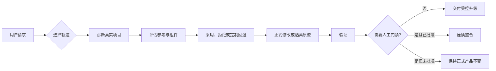
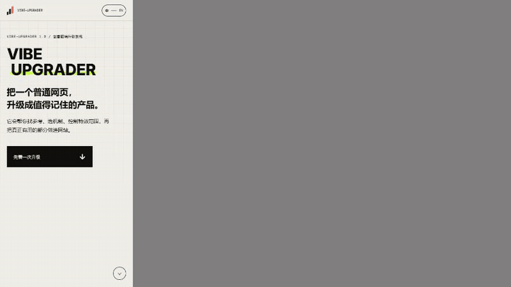
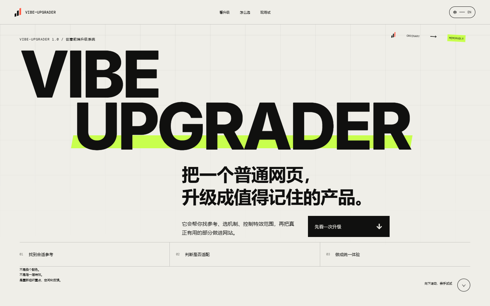
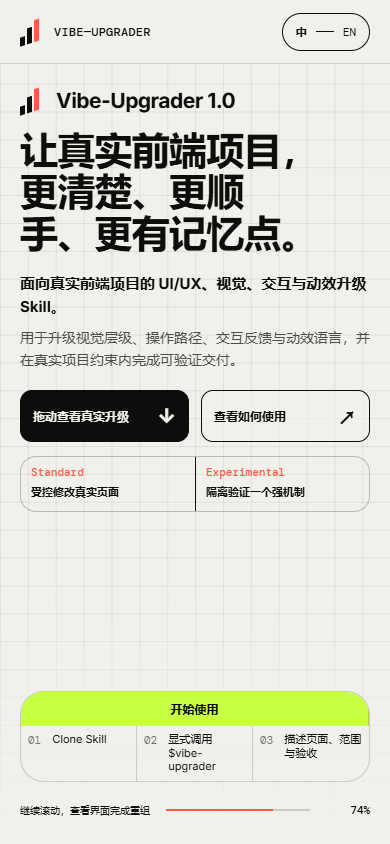

<div align="center">

# Vibe-Upgrader

**面向真实前端项目的 UI/UX、视觉与交互升级 Skill：默认克制；需要强视觉时，先做隔离原型，再经过人工门禁。**

[简体中文](./README.md) · [English](./README.en.md)

 

[在线 Showcase](https://vibe-upgrader-showcase.vercel.app/) · [AIGC 真实案例](https://vibe-upgrader-aigc-case.vercel.app/) · [GitHub Release](https://github.com/Zeno-wistom/vibe-upgrader/releases/tag/v1.0.0) · [English README](./README.en.md)

</div>

<table>
  <tr>
    <td width="50%" align="center">
      <a href="https://vibe-upgrader-showcase.vercel.app/">
        
      </a>
      <br>
      <strong>交互式 Showcase</strong><br>
      <sub>亲手体验升级前后对比、双轨决策与机制实验室</sub>
    </td>
    <td width="50%" align="center">
      <a href="https://vibe-upgrader-aigc-case.vercel.app/">
        
      </a>
      <br>
      <strong>AIGC 真实项目案例</strong><br>
      <sub>在既有内容与约束中完成产品化升级</sub>
    </td>
  </tr>
</table>

## 它解决什么问题

Vibe-Upgrader 用于升级已经存在的前端产品。它先理解真实项目、修改范围和用户约束，再决定是直接做一次稳妥的局部提升，还是先隔离验证一个更大胆的视觉机制。它不会把每个需求都理解成“重做整站”，也不会为了炫技堆叠无关组件。

## 三步开始

### 1. Clone

把 Skill 克隆到 Codex Skills 目录：

```bash
git clone https://github.com/Zeno-wistom/vibe-upgrader.git ~/.codex/skills/vibe-upgrader
```

### 2. Invoke

在兼容 Skills 的 Agent 中显式调用：

```text
$vibe-upgrader
```

### 3. Describe the upgrade

说明要改的页面、范围、必须保留的内容和验收标准：

```text
优化这个后台的搜索、筛选和批量操作区域。
保留其余页面，不要重做整个产品。
```

Vibe-Upgrader 只允许显式调用；安装后不会自动介入其他前端任务。

> 公共仓库不包含完整的本地 MotionSites 语料库，因为其批量再分发授权无法确认。缺少这个可选数据源时，Skill 会说明限制，并继续使用组件评估或定制回退。

## Standard 与 Experimental

| | Standard | Experimental |
| --- | --- | --- |
| 适合 | 真实产品中的局部 UI/UX 升级 | 强视觉方向或非标准交互探索 |
| 实施方式 | 在受控范围内直接修改 | 先制作一个隔离原型 |
| 创意检索 | 不做与任务无关的检索 | 只找完成一个机制所需的参考 |
| 人工门禁 | 通常不需要视觉批准 | 未经明确批准不得整合 |

## 两个真实 Prompt 示例

### Standard

```text
$vibe-upgrader

升级这个仪表盘的搜索、筛选和批量操作区域。
保持其余页面稳定，不要重做整个产品。
```

### Experimental

```text
$vibe-upgrader

探索一种更沉浸的数字档案浏览方式。
先在隔离预览中完成视觉方向，未经我批准不要整合。
```

## 工作流程



正式协议 `decision_task` 3.0 会记录权限模式、升级轨道、来源依据、组件决策、原型状态和验证边界。

## 在线 Showcase

[打开在线 Showcase →](https://vibe-upgrader-showcase.vercel.app/)

Showcase 把流程做成了可操作体验：升级前后拖拽对比、Standard / Experimental 双轨控制台、可拖动的决策流程，以及一个小型机制实验室。



MotionSites 只用于机制级参考，没有复制页面。`BlurText` 启发了轻量原生显现；`SpotlightCard`、`ScrollStack` 和 `TiltedCard` 因为与任务冲突而被拒绝，最终的空间响应由定制机制完成。

<details>
<summary>查看桌面端与移动端静态截图</summary>





</details>

## AIGC 真实项目案例

[打开 PINK SIGNALS →](https://vibe-upgrader-aigc-case.vercel.app/)

PINK SIGNALS 是一个已经存在的项目，拥有七张完成作品、既定视觉系统和严格内容约束。Vibe-Upgrader 保留了作品与声明，重点改善作品浏览、全屏详情切换、视觉层级、响应式体验和隔离式 Signal 体验，而不是从零重做。

案例中的人物、场景和类似资料卡的内容均为 AIGC 虚构生成，不对应真实人物，也不构成真实交友资料。

## 约束与护栏

- 默认不重做全站。
- 不为炫技堆叠组件。
- Experimental 未经人工批准不得整合到正式页面。
- 外部组件不可用或被拒绝时，不降低质量目标。
- 运行时不修改正式安装的 Skill 目录。
- 用户约束和已经核实的项目事实优先。

## 仓库结构

```text
vibe-upgrader/
├── SKILL.md          # Skill 入口与双轨路由
├── agents/           # Agent 元数据
├── scripts/          # 决策、检索、安装与搜索辅助脚本
├── references/       # 协议与验证说明
├── assets/           # 可公开的别名数据；本地语料已排除
├── tests/            # 工作流与运行时写入回归测试
└── docs/media/       # README 媒体素材
```

## 环境与兼容性

- Codex 或其他支持 Skills 与显式调用的 Agent 环境。
- 可选辅助脚本和验证工具需要 Python **3.10+**。
- 核心 Skill 不需要 Node.js；只有用户选择兼容的组件 CLI 或 Registry 检索时才会使用。
- 开发证据中的 Windows 路径不是安装要求；公共仓库使用可移植的相对路径。

## License 与第三方边界

Vibe-Upgrader 自有代码与文档使用 [MIT License](./LICENSE)。

- [MotionSites](https://motionsites.ai/) 是外部创意参考来源。完整本地语料库不包含在公共仓库中。
- [React Bits](https://github.com/DavidHDev/react-bits) 是可选组件候选来源。仓库不打包其组件源码；React Bits 使用自己的 MIT + Commons Clause 条款。
- Showcase 与 AIGC 案例是独立项目，各自保留依赖与素材来源边界。

版本记录见 [CHANGELOG.md](./CHANGELOG.md) 和 [v1.0.0 Release](https://github.com/Zeno-wistom/vibe-upgrader/releases/tag/v1.0.0)。
