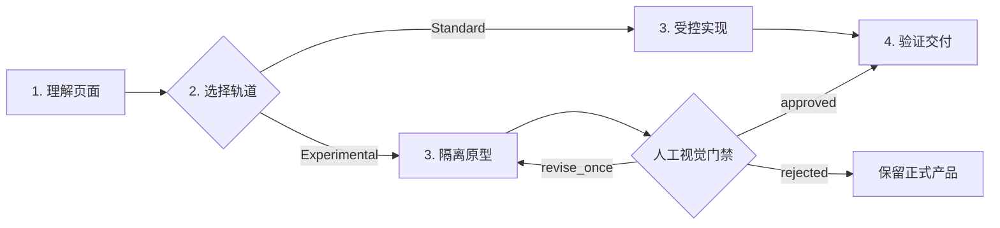

<div align="center">

# Vibe-Upgrader

**让真实前端项目，更清楚、更顺手、更有记忆点。**

一个用于升级 UI/UX、视觉层级、操作路径、交互反馈与动效语言的 Codex Skill。

[简体中文](./README.md) · [English](./README.en.md)

 

[在线 Showcase](https://vibe-upgrader-showcase.vercel.app/) · [AIGC 真实案例](https://vibe-upgrader-aigc-case.vercel.app/) · [GitHub Release](https://github.com/Zeno-wistom/vibe-upgrader/releases/tag/v1.0.0) · [English README](./README.en.md)

</div>

**快速导航：** [三步开始](#三步开始) · [升级能力](#它具体能升级什么) · [选择轨道](#standard-与-experimental) · [调用模板](#3-描述升级任务) · [真实效果](#看真实效果)

<table>
  <tr>
    <td width="50%" align="center">
      <a href="https://vibe-upgrader-showcase.vercel.app/">
        
      </a>
      <br>
      <strong>交互式 Showcase</strong><br>
      <sub>理解它能升级什么、该选哪条轨道，以及如何开始</sub>
    </td>
    <td width="50%" align="center">
      <a href="https://vibe-upgrader-aigc-case.vercel.app/">
        
      </a>
      <br>
      <strong>AIGC 真实项目案例</strong><br>
      <sub>在既有内容、品牌和约束中完成产品化升级</sub>
    </td>
  </tr>
</table>

## 5 秒看懂

Vibe-Upgrader 面向**已经存在的前端项目**。它先理解页面、目标、范围和必须保留的内容，再选择合适的升级轨道并完成可验证交付。

| 你关心的问题 | 答案 |
| --- | --- |
| 这是什么？ | 一个需要显式调用的 Codex Skill，不是网页模板或组件包。 |
| 它能升级什么？ | 信息层级、操作路径、状态反馈、动效语言、响应式体验与品牌表达。 |
| 会不会直接重做整站？ | Standard 在真实产品中受控修改；大胆方向先进入 Experimental 隔离原型。 |
| 怎样开始？ | Clone Skill，调用 `$vibe-upgrader`，描述页面、范围、保留内容和验收标准。 |

## 它具体能升级什么

| 能力 | 常见问题 | 交付结果 |
| --- | --- | --- |
| 信息层级 | 所有内容权重接近，用户不知道先看哪里 | 主任务、关键数据和辅助信息形成清楚的视线顺序 |
| 操作路径 | 高频任务步骤多、入口散、容易迷路 | 收敛步骤，强化主操作，让下一步始终可见 |
| 状态反馈 | 点击后没有处理中、成功或失败反馈 | 建立点击、处理中、完成与下一步之间的状态链 |
| 动效语言 | 动画只负责装饰，无法解释变化 | 用动效说明状态、空间关系和操作结果 |
| 响应式与品牌 | 大小屏密度失衡，界面缺少一致性 | 统一布局、组件、节奏和品牌表达，并完成多视口验证 |

## 三步开始

### 1. Clone Skill

macOS / Linux：

```bash
git clone https://github.com/Zeno-wistom/vibe-upgrader.git ~/.codex/skills/vibe-upgrader
```

Windows PowerShell：

```powershell
git clone https://github.com/Zeno-wistom/vibe-upgrader.git "$env:USERPROFILE\.codex\skills\vibe-upgrader"
```

### 2. 显式调用

在支持 Skills 的 Agent 中输入：

```text
$vibe-upgrader
```

安装后不会自动介入其他前端任务，只有显式调用才会启动完整工作流。

### 3. 描述升级任务

推荐按这五项描述，信息越具体，结果越稳定：

```text
$vibe-upgrader

页面：要升级哪个页面或区域
目标：用户完成什么任务时遇到了什么问题
范围：这次允许修改到哪里
保留：必须保留的内容、逻辑、品牌或组件
验收：怎样判断升级已经完成
```

例如：

```text
$vibe-upgrader

页面：仪表盘的搜索、筛选和批量操作区域
目标：让用户更快找到目标记录并完成批量处理
范围：只修改列表顶部工具区和相关反馈
保留：现有数据结构、列表和权限逻辑
验收：桌面与移动端路径清楚，键盘可用，构建和控制台检查通过
```

> [!TIP]
> 不确定轨道时直接描述真实目标即可。Vibe-Upgrader 默认选择 Standard；只有任务明确需要强视觉或非标准交互时才进入 Experimental。

<details>
<summary><strong>更新已经安装的 Skill</strong></summary>

macOS / Linux：

```bash
git -C ~/.codex/skills/vibe-upgrader pull --ff-only
```

Windows PowerShell：

```powershell
git -C "$env:USERPROFILE\.codex\skills\vibe-upgrader" pull --ff-only
```

</details>

## Standard 与 Experimental

| | Standard | Experimental |
| --- | --- | --- |
| 适合 | 后台、工具、内容产品和已有业务页面 | 品牌首屏、叙事页面和非标准交互 |
| 做法 | 保留现有架构，集中解决关键体验问题 | 先在隔离环境验证一个强机制 |
| 交付 | 在受控范围内直接修改并验证 | 先交付一个可运行原型 |
| 边界 | 以任务验收标准为结束点 | 通过 `approved / revise_once / rejected` 人工门禁后再决定是否整合 |

**选择原则：** 真实业务页面优先 Standard；需要先判断视觉方向是否成立时选择 Experimental。

<details>
<summary><strong>查看两个可直接复制的 Prompt</strong></summary>

### Standard

```text
$vibe-upgrader

升级这个仪表盘的搜索、筛选和批量操作区域。
保持其余页面稳定，不要重做整个产品。
完成后验证桌面端、移动端、键盘操作和控制台。
```

### Experimental

```text
$vibe-upgrader

探索一种更沉浸的数字档案浏览方式。
先在隔离预览中完成一个核心交互机制。
未经我批准不要整合到正式页面。
```

</details>

## 它怎样工作



正式协议 `decision_task` 3.0 会记录权限模式、升级轨道、来源依据、组件决策、原型状态和验证边界。它让“为什么这样改、改到了哪里、验证了什么”可以被检查，而不是只留下一个看起来更漂亮的页面。

## 看真实效果

### 交互式 Showcase

[打开在线 Showcase →](https://vibe-upgrader-showcase.vercel.app/)

Showcase 用可操作演示解释四件事：

1. 同一个产品升级前后差在哪里；
2. 信息层级、操作路径、状态反馈和动效语言分别能解决什么；
3. Standard 与 Experimental 应该怎样选择；
4. 如何把真实需求变成可验证交付。


<details>
<summary>查看桌面端与移动端静态截图</summary>


</details>

### AIGC 真实项目案例

[打开 PINK SIGNALS →](https://vibe-upgrader-aigc-case.vercel.app/)

PINK SIGNALS 已经拥有七张完成作品、既定视觉系统和严格内容约束。Vibe-Upgrader 保留作品与声明，集中改善作品浏览、全屏详情切换、视觉层级、响应式体验和隔离式 Signal 体验。

案例中的人物、场景和类似资料卡的内容均为 AIGC 虚构生成，不对应真实人物，也不构成真实交友资料。

## 约束与护栏

- 修改范围由用户授权和项目事实共同决定。
- Standard 保持真实业务与现有架构稳定。
- Experimental 先完成隔离原型，再经过人工视觉门禁。
- 外部参考和组件必须说明来源、适配结论与替代方案。
- 运行时保持正式安装目录不变。
- 构建通过只代表工程可运行；视觉结果仍需要真实阅读和人工判断。

## 仓库结构

```text
vibe-upgrader/
├── SKILL.md          # Skill 入口与双轨路由
├── agents/           # Agent 元数据
├── scripts/          # 决策、检索、安装与搜索辅助脚本
├── references/       # 协议、来源边界与验证说明
├── assets/           # 可公开的别名数据；本地语料已排除
├── tests/            # 工作流与运行时写入回归测试
└── docs/media/       # README 媒体素材
```

## 环境与兼容性

- Codex 或其他支持 Skills 与显式调用的 Agent 环境。
- 核心 Skill 不需要 Node.js。
- 可选辅助脚本和验证工具需要 Python **3.10+**。
- 只有用户选择兼容的组件 CLI 或 Registry 检索时才会使用 Node.js。
- Windows、macOS 与 Linux 均使用可移植的仓库相对路径。

## License 与第三方边界

Vibe-Upgrader 自有代码与文档使用 [MIT License](./LICENSE)。

- [MotionSites](https://motionsites.ai/) 是外部创意参考来源。完整本地语料库未放入公共仓库，因为其批量再分发授权无法确认；缺少该可选数据源时，Skill 会明确说明限制并继续使用组件评估或定制回退。
- [React Bits](https://github.com/DavidHDev/react-bits) 是可选组件候选来源。本仓库不打包其组件源码；React Bits 使用自己的 MIT + Commons Clause 条款。
- Showcase 与 AIGC 案例是独立项目，各自保留依赖与素材来源边界。

版本记录见 [CHANGELOG.md](./CHANGELOG.md) 和 [v1.0.0 Release](https://github.com/Zeno-wistom/vibe-upgrader/releases/tag/v1.0.0)。
