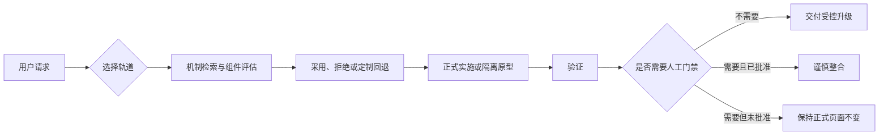

<div align="center">

# Vibe-Upgrader

**面向真实前端项目的 UI/UX、视觉与交互升级 Skill：默认克制；需要强视觉时，先做隔离原型，再经过人工门禁。**

[官方 Showcase](https://vibe-upgrader-showcase.vercel.app/) · [真实案例](https://vibe-upgrader-aigc-case.vercel.app/) · [English](./README.md)

 


</div>

## 它解决什么问题

Vibe-Upgrader 用于升级已有前端产品，不会把每个需求都理解为“重做整站”。它先读取真实项目、明确修改面与用户约束，再选择两条轨道之一：

- **Standard**：局部改善信息层级、可用性、内容、控件、响应式体验与品牌质感。
- **Experimental**：探索强视觉动效或非标准交互；先制作一个隔离原型，未经人工批准不得进入正式产品。

只有在创意参考确实有价值时，它才会检索具体机制、评估表现型组件、拒绝不合适的候选，并提供同等目标的定制回退。外部组件不可用，不等于可以降低最终质量。

## 快速开始

从公共仓库安装到干净的 Skills 目录：

```bash
git clone https://github.com/Zeno-wistom/vibe-upgrader.git ~/.codex/skills/vibe-upgrader
```

然后在兼容的 Agent 中显式调用：

```text
$vibe-upgrader
```

Vibe-Upgrader 只允许显式调用。安装后，它不会隐式介入所有前端任务。

> 公共仓库有意不附带完整的本地 MotionSites 语料库，因为无法确认其公开批量再分发授权。缺少该可选语料时，Skill 会明确给出警告，并继续执行组件评估或定制回退。

## 双轨模式

| Standard | Experimental |
| --- | --- |
| 真实产品中的局部 UI/UX 升级 | 强视觉方向或非标准交互 |
| 直接在受控范围内实施 | 先制作一个隔离原型 |
| 不进行无关创意检索 | 只检索完成一个机制所需的参考 |
| 不需要视觉人工门禁 | 未经人工批准不得整合 |

## 如何使用

### Standard 示例

```text
$vibe-upgrader

Upgrade the search, filtering, and bulk-action area of this dashboard.
Keep the rest of the page stable and do not redesign the whole product.
```

### Experimental 示例

```text
$vibe-upgrader

Explore a more immersive way to browse this digital archive.
Build the visual direction in an isolated preview and do not integrate it
until I approve it.
```

## 工作流程



正式协议 `decision_task` 3.0 会明确记录权限模式、升级轨道、来源依据、组件决策、原型状态和验证边界。

## 官方 Showcase

[打开线上 Showcase →](https://vibe-upgrader-showcase.vercel.app/)


Showcase 把工作流做成了可操作的体验：升级前后拖拽对比、Standard/Experimental 双轨控制台、可拖动的决策流程，以及小型机制实验室。MotionSites 只用于机制级参考，没有复制页面。`BlurText` 启发了轻量原生显现；`SpotlightCard`、`ScrollStack` 和 `TiltedCard` 因与任务冲突被拒绝，最终的空间响应由定制机制完成。

<details>
<summary>移动端预览</summary>


</details>

## 真实项目案例

[打开 PINK SIGNALS →](https://vibe-upgrader-aigc-case.vercel.app/)


PINK SIGNALS 是一个已经存在的项目，拥有七张完成作品、既定视觉系统和严格内容约束。Vibe-Upgrader 没有简单重做整站，而是保留作品和声明，改善了作品浏览、全屏详情切换、视觉层级、响应式体验和隔离式 Signal 体验。

案例中的人物、场景和类似资料卡的内容均为 AIGC 虚构生成，不对应任何真实人物，也不构成真实交友资料。

## 约束与护栏

- 默认不重做全站。
- 不为炫技堆叠组件。
- Experimental 未经人工批准不得整合正式页面。
- 外部组件不可用或被拒绝时，不降低质量目标。
- 运行时不修改正式安装的 Skill 目录。
- 用户约束和已经核实的项目事实优先。

## 仓库结构

```text
vibe-upgrader/
├── SKILL.md          # Skill 入口和双轨路由
├── agents/           # Agent 元数据
├── scripts/          # 决策、检索、安装和搜索辅助脚本
├── references/       # 协议与验证说明
├── assets/           # 仅包含可公开的别名数据；本地语料已排除
├── tests/            # 工作流和运行时写入回归测试
└── docs/media/       # 优化后的 README 素材
```

发布说明、许可证和更新记录位于仓库根目录。

## 环境与兼容性

- Codex 或其他支持 Skills 与显式调用的 Agent 环境。
- 可选辅助脚本和验证工具需要 Python **3.10+**。
- 核心 Skill 不要求 Node.js；仅在用户选择兼容的组件 CLI 或 Registry 检索时使用。
- 开发证据中的 Windows 路径不是安装要求；公共仓库使用可移植的相对路径。

## 许可证与致谢

Vibe-Upgrader 自有代码与文档使用 [MIT License](./LICENSE)。

第三方资源、组件实现、网站参考、截图和数据集不会自动受该许可证覆盖：

- [MotionSites](https://motionsites.ai/) 是外部创意参考来源。由于无法确认公开批量再分发许可，完整本地语料库**不包含在仓库中**。
- [React Bits](https://github.com/DavidHDev/react-bits) 是可选组件候选来源。Vibe-Upgrader 不打包 React Bits 组件源码；React Bits 使用其自己的 MIT + Commons Clause 条款。
- Showcase 与真实案例是独立项目，各自保留依赖与素材来源边界。

## 版本发布

参见 [CHANGELOG.md](./CHANGELOG.md) 和 [v1.0.0 Release](https://github.com/Zeno-wistom/vibe-upgrader/releases/tag/v1.0.0)。
